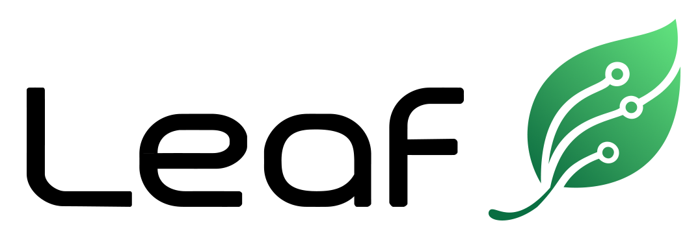

<p align="center">

</p>

<p align="center">


</p>

<h1 align="center">Leaf</h1>

<p align="center">
A versatile and efficient proxy framework.
</p>

## Supported Protocols

### Proxy Protocols

| Protocol | Inbound | Outbound |
|---|---|---|
| HTTP | ✅ | ❌ |
| SOCKS5 | ✅ | ✅ |
| Shadowsocks | ✅ | ✅ |
| Trojan | ✅ | ✅ |
| VMess | ❌ | ✅ |
| Vless | ❌ | ✅ |

### Transports & Security

| Transport | Inbound | Outbound | Notes |
|---|---|---|---|
| WebSocket | ✅ | ✅ | |
| TLS | ✅ | ✅ | |
| QUIC | ✅ | ✅ | |
| AMux | ✅ | ✅ | Leaf specific multiplexing |
| Obfs | ❌ | ✅ | Simple obfuscation |
| Reality | ❌ | ✅ | Xray Reality |
| MPTP | ✅ | ✅ | Multi-path Transport Protocol (Aggregation) ([Architecture](docs/mptp_architecture.md), [Usage](docs/mptp_usage.md)) |

### Traffic Control

| Feature | Inbound | Outbound | Notes |
|---|---|---|---|
| Chain | ✅ | ✅ | Proxy chaining |
| Failover | ❌ | ✅ | Failover with health check |

### Transparent Proxying

| Mechanism | Inbound | Outbound | Notes |
|---|---|---|---|
| TUN | ✅ | ❌ | Linux, macOS, Windows, iOS, Android; lwip, smoltcp |
| NF | ✅ | ❌ | Windows, [NetFilter SDK](https://netfiltersdk.com/) |
| TPROXY | ❌ | ❌ | Linux; Coming soon |

## Plugins

Protocols and transports can also live outside the binary. A plugin is a shared
library that exports a small C ABI, which leaf loads at startup and drives as an
ordinary outbound -- so a plugin can be written in any language that can produce
one, and shipped without rebuilding leaf.

| Plugin | Language | Kind |
|---|---|---|
| [`shadowsocks-cabi-rs`](leaf-plugins/shadowsocks-cabi-rs) | Rust | Shadowsocks, TCP and UDP |
| [`tls-cabi-rs`](leaf-plugins/tls-cabi-rs) | Rust | TLS transport |
| [`tls-cabi-go`](leaf-plugins/tls-cabi-go) | Go | TLS transport |
| [`trojan-cabi-go`](leaf-plugins/trojan-cabi-go) | Go | Trojan, TCP and UDP |
| [`socks5-cabi-c`](leaf-plugins/socks5-cabi-c) | C | SOCKS5, TCP |
| [`socks5-cabi-zig`](leaf-plugins/socks5-cabi-zig) | Zig | SOCKS5, TCP |

The two SOCKS5 plugins are the same protocol written twice, in two languages
with no runtime of their own, and both are held to the same end-to-end suite as
leaf's own SOCKS5 outbound.

A plugin is configured as an outbound like any other, and can be chained with
built-in ones:

```json
{
  "tag": "ss-plugin",
  "protocol": "plugin",
  "settings": {
    "path": "./target/release/libshadowsocks_cabi_rs.dylib",
    "host": "example.com",
    "port": 8388,
    "args": "chacha20-ietf-poly1305;password",
    "sha256": "9f86d081884c7d659a2feaa0c55ad015a3bf4f1b2b0b822cd15d6c15b0f00a08"
  }
}
```

`args` is passed to the plugin untouched; `host` and `port` are required by
plugins that connect to a server of their own, and rejected by transport plugins
that layer on the previous outbound in a chain.

`path` must have a directory part -- a bare library name would let the dynamic
loader search `LD_LIBRARY_PATH` or the DLL search order, which is not a choice a
config file gets to hand to the environment -- and leaf refuses a library that
anyone on the host can rewrite, whether that is the file's own mode or a
world-writable directory with no sticky bit around it.

There is no plugin directory and nothing is scanned. Every plugin leaf loads is
one an outbound named, which is the same decision as refusing a bare name: what
runs inside the proxy should be what the config says outright, not what the
filesystem happened to be holding.

`sha256` is optional and worth setting. Loading a shared library runs whatever
its last writer put there, in leaf's process with leaf's privileges; the digest
is the one check that still holds if that writer was not you. Get it with
`shasum -a 256 <file>`, or from `--verify-plugin` below, and leaf refuses to
load anything else.

None of this contains a plugin that is actually hostile, and it is not meant
to. A plugin runs in leaf's process with leaf's privileges, so deploying one is
the same decision as running any other binary on the host. What the checks above
buy you is knowing *which* file you loaded; what the host's own defences buy you
-- a validated descriptor, bounded buffers, clamped size hints, panic barriers
around every callback, an opaque instance id rather than a pointer -- is
surviving a plugin that is merely wrong.

- The ABI, and the contract both sides must keep, is defined in
  [`leaf-plugin-abi`](leaf-plugin-abi/src/lib.rs) and in the canonical C header
  [`leaf_plugin_abi.h`](leaf-plugin-abi/include/leaf_plugin_abi.h). C and Zig
  plugins include that header directly; a Rust plugin depends on the crate.
- Go plugins are written against [`leaf-abi-go`](leaf-plugins/leaf-abi-go), the
  SDK that keeps the descriptor, the vtables, cgo's const-pointer shims, panic
  recovery and the blocking-`net.Conn` adapter out of the plugin.
- Runnable examples:
  [shadowsocks](examples/shadowsocks-cabi/README.md),
  [TLS and Trojan chains](examples/tls-cabi/README.md).
- The [end-to-end suite](leaf-e2e/README.md) exercises the host against
  cooperative and deliberately hostile plugins; `make e2e` runs it, and
  `make plugin-test` runs each plugin's own unit tests.

### Checking a plugin before you deploy it

`--verify-plugin` runs the loader's own checks -- the path, the file's
permissions, the digest, the descriptor -- without a config file and without
starting a proxy, and prints what the plugin declares:

```sh
$ leaf --verify-plugin ./target/release/libshadowsocks_cabi_rs.dylib
path:      /opt/rust/leaf/target/release/libshadowsocks_cabi_rs.dylib
sha256:    3263ea158c1557731f7b3347cd38e31e563937f08acef9caa653a5fde3fd21fe
name:      leaf-shadowsocks-cabi-rs-plugin
version:   0.1.0
abi:       2.1 (host 2.1)
stream:    connect_type=proxy-tcp
           the outbound must set host and port
datagram:  transport_type=unreliable
           the outbound must set host and port
```

The `connect_type` lines are the ones to read before writing the outbound: a
plugin that dials a server of its own needs `host` and `port`, and a transport
plugin that layers on whatever precedes it in a chain is refused if you give it
any. The `sha256` line is the value to pin.

It exits non-zero on anything leaf would refuse to load, and with the same
message the proxy would have failed to start with, so it works as a deployment
check. `--verify-plugin-sha256 <hex>` additionally requires the file to match a
digest you already hold.

Reading a descriptor means opening the library, which runs its initialisers in
this process -- so this is a check to run on a build you were going to deploy,
not a way to triage one you suspect.

### Building a leaf that can load plugins

Plugin support is behind a cargo feature, since it is what pulls in dynamic
loading:

```sh
cargo build -p leaf-cli --release --features leaf/plugin
```

Neither the released binaries nor CI build that, so a leaf that loads plugins is
one you build. On macOS and Windows the line above is the whole story. On Linux
it is not: the releases are statically linked against musl, and a static binary
has no dynamic loader to call, so `dlopen` fails whatever the config says. Build
for a dynamically linked target instead -- `x86_64-unknown-linux-gnu` or
`aarch64-unknown-linux-gnu` -- with cargo on the host, or with `cross` and the
matching toolchain image.

`leaf --verify-plugin <path>` on the result is the quickest way to tell a build
that can load plugins from one that cannot: a build without the feature says so
and exits non-zero.

The plugins themselves are built from `leaf-plugins/`, each with its own
toolchain -- `cargo build -p <name>` for the Rust ones, `go build
-buildmode=c-shared` for the Go ones, and see each plugin's README for C and
Zig. A plugin and the leaf that loads it must agree on the ABI major version,
which `--verify-plugin` prints for both.

## Building

```sh
cargo build -p leaf-cli --release
./target/debug/leaf --help
```

## License

This project is licensed under the [Apache License 2.0](https://github.com/eycorsican/leaf/blob/master/LICENSE).
