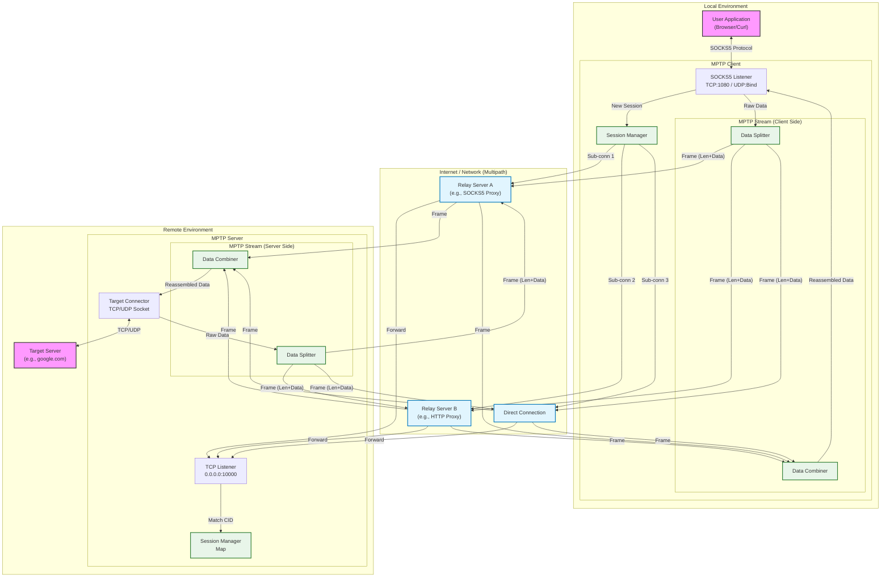
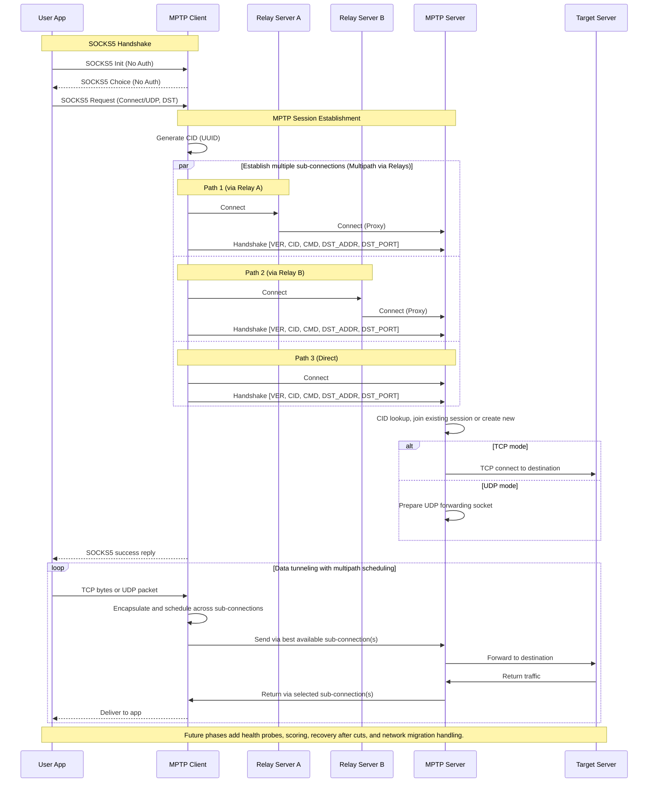

# MPTP Architecture

## System Overview

MPTP (Multipath Transport Protocol) aggregates multiple reliable connections into a single logical tunnel to provide bandwidth aggregation and connection resilience.

## Protocol Sequence

This diagram details the connection establishment and data transfer phases.

